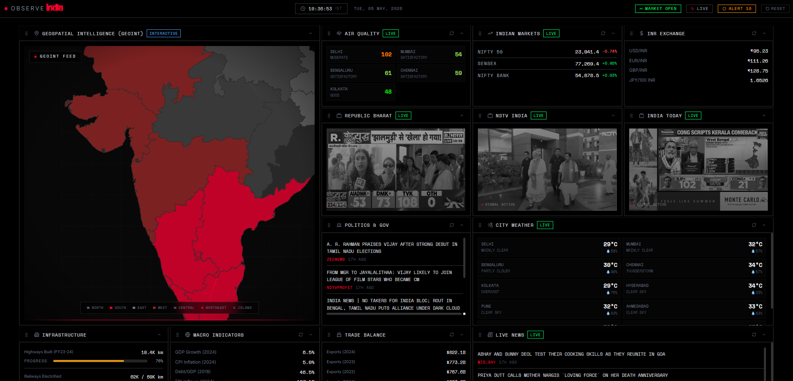

# 🇮🇳 Observe India: Real-Time Intelligence Dashboard



> **A High-Fidelity, Technical Intelligence Hub for National Monitoring and Situational Awareness.**

Observe India is a professional, data-dense dashboard designed for high-stakes national monitoring. It combines real-time data feeds from multiple global APIs with a sophisticated wireframe aesthetic to provide a comprehensive overview of India's economic, social, and infrastructure landscape.

---

## ⚡ Core Intelligence Pipeline

*   **Intelligent Grid Architecture**: Features a responsive, dynamic panel system that automatically rearranges and resizes data widgets based on viewport priority and data density, ensuring a clean workspace at any scale.
*   **Groq AI Intelligence**: Leverages advanced LLMs to generate professional, context-aware 3-sentence intelligence briefs for every district in India.
*   **Hyper-Local Monitoring**: Precise coordinates for any district via **Open-Meteo Geocoding**, providing accurate Weather and AQI data.
*   **Live Media Streams**: Integrated YouTube live news channels for instant situational awareness.
*   **Economic Indicators**: Real-time NIFTY/SENSEX indices, INR exchange rates, and RBI policy metrics.

## 🎨 Design Philosophy: Technical Wireframe

The interface focuses on technical clarity and refined data-centric aesthetics:
- **Monochrome Precision**: High-contrast black, white, and grey tones for reduced cognitive load.
- **Data-Dense Layout**: Maximizes information visibility through optimized panel spacing and resizing logic.
- **Technical Typography**: Heavy use of monospace fonts for data points and uppercase tracking for a systematic feel.
- **Grid Overlay**: A technical wireframe map with meridian/parallel overlays and pulsating city nodes.

---

## 🛠️ Technology Stack

- **Frontend**: React 19 + Vite 6
- **Styling**: Tailwind CSS 4 (Technical Modernist)
- **Map Engine**: MapLibre GL (Wireframe/Contour Style)
- **APIs Integrated**:
  - **Intelligence**: Groq AI
  - **Environment**: Open-Meteo (Weather & AQI)
  - **Financial**: Yahoo Finance (Markets), Open-ER (Currency)
  - **News**: NewsData.io, NewsAPI.org, GDELT Project
  - **Social**: Wikipedia REST API

---

## 🚀 Getting Started

### 1. Clone the repository
```bash
git clone https://github.com/your-username/observe-india.git
cd observe-india
```

### 2. Install dependencies
```bash
npm install
```

### 3. Configure Environment Variables
Create a `.env` file in the root directory:
```env
VITE_GROQ_API_KEY=your_groq_key
VITE_NEWSDATA_API_KEY=your_newsdata_key
VITE_NEWSAPI_KEY=your_newsapi_key
VITE_OMDB_API_KEY=your_omdb_key
```

### 4. Run locally
```bash
npm run dev
```

---

## 📄 License

This project is licensed under the **MIT License** - see the [LICENSE](LICENSE) file for details.

## 🤝 Contributing

Contributions are welcome! Please see [CONTRIBUTING.md](CONTRIBUTING.md) for guidelines on how to get started.

---

<p align="center">
  <a href="https://what-s-happening-in-kerala.vercel.app/">
    
  </a>
</p>
