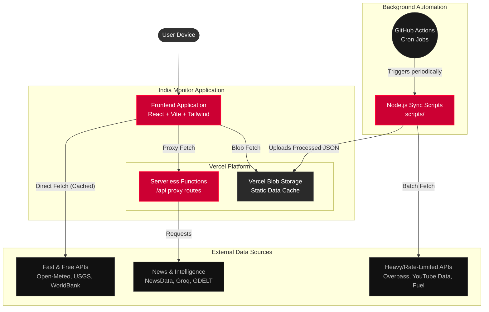

# India Monitor — Architecture & Design

India Monitor is a highly responsive, real-time surveillance and intelligence dashboard built to track national and state-level metrics across India. The application aggregates data from over a dozen distinct APIs and surfaces them in a "Nothing OS" inspired, glassmorphic UI.

---

## 1. Core Technology Stack

- **Frontend Framework:** React 19 + Vite
- **Styling:** Tailwind CSS 4.0 + Custom CSS (Nothing OS aesthetic: high contrast, dark mode, grid-based, mono-spaced typography)
- **UI Components:** 
  - Layout: `react-grid-layout` for draggable, resizable, persistent panels
  - Icons: `lucide-react`
  - Maps: `react-map-gl` and `maplibre-gl` for geo-spatial visualizations
- **Backend & Deployment:** Vercel (Serverless Functions + Vercel Blob)
- **Automation:** GitHub Actions

---

## 2. System Architecture



The architecture is designed to handle multiple external APIs robustly without overwhelming the client or hitting rate limits. It relies on a 3-tier caching strategy:

### A. The Client Layer (Frontend)
The React frontend handles all rendering and layout persistence. 
- **Local Storage:** Layout configurations (panel positions and sizes) are saved to local storage so the dashboard persists between sessions.
- **Client-side Caching:** The `fetchWithCache` utility stores API responses in `localStorage` with specific TTLs (Time To Live). This prevents the dashboard from refetching data every time the user navigates between the National and State views.

### B. The Edge/Proxy Layer (Vercel Serverless Functions)
Located in the `api/` directory, these serverless functions act as a middleman between the client and external APIs.
- **CORS Bypass:** External APIs that don't support CORS are proxied through these functions.
- **Edge Caching:** Using `Cache-Control: s-maxage=..., stale-while-revalidate=...`, Vercel's CDN caches the responses at the edge. If thousands of users load the dashboard, only one request actually hits the external API.

### C. The Background Sync Layer (GitHub Actions + Vercel Blob)
For heavy, rate-limited, or slow APIs (e.g., OpenStreetMap Overpass, YouTube Data API), fetching data on-demand is unreliable. 
- **Cron Jobs:** GitHub Actions (`.github/workflows/`) run Node.js scripts (`scripts/`) on a scheduled basis (daily or every 3 weeks).
- **Blob Storage:** These scripts fetch the massive datasets offline, process them, and upload the finalized JSON payloads to **Vercel Blob Storage**.
- The frontend simply requests the static JSON from the Blob via a proxy route (`api/fuel-cache`, `api/ev-cache`), ensuring 100% uptime and instant load speeds.

---

## 3. Data Sources & Intelligence

India Monitor aggregates data from the following domains:

| Domain | Source | Sync Method |
| :--- | :--- | :--- |
| **Weather & AQI** | Open-Meteo API | Direct Client Fetch (Cached) |
| **Earthquakes** | USGS API | Direct Client Fetch (Cached) |
| **Macro Economy** | World Bank API | Direct Client Fetch (Cached) |
| **Financial Markets** | Yahoo Finance (via allorigins) | Proxy Fetch |
| **News & Infra** | NewsData.io / NewsAPI / GDELT | Edge Proxy (`/api/news`) |
| **State Intelligence** | Groq (Llama-3.1) / Wikipedia | Direct / Proxy Fetch |
| **Fuel Prices** | IndianAPI | GitHub Action → Vercel Blob |
| **EV & Petrol Pumps**| OpenStreetMap (Overpass) | GitHub Action → Vercel Blob |
| **Regional Broadcasts**| YouTube Data API v3 | GitHub Action → Vercel Blob |

---

## 4. Folder Structure

```text
india-monitor/
├── .github/
│   └── workflows/        # CI/CD Cron jobs for background data syncing
├── api/                  # Vercel Serverless Functions (Edge caching & Proxies)
├── docs/                 # Documentation (You are here)
├── scripts/              # Node.js scripts for fetching & uploading Blob data
├── public/               # Static assets
└── src/
    ├── components/       # React UI Components (Panels, Maps, Layouts)
    ├── data/             # Static configurations (Constants, District Coords)
    ├── hooks/            # Custom React hooks (e.g., useAutoRefresh)
    └── services/         # API integrations and cache utilities (api.js, fetcher.js)
```

---

## 5. Design Philosophy

The visual identity is heavily inspired by hardware/software companies like Nothing. Key principles include:

1. **Information Density:** High density of data using monospace fonts (e.g., JetBrains Mono, Roboto Mono) and tight grids.
2. **Glassmorphism:** Subtle translucent backgrounds with thin, semi-transparent borders.
3. **Accent Colors:** A predominantly monochromatic dark theme punctuated by stark, utilitarian accent colors (Red, Cyan, Amber, Green) to indicate status (Live, Warning, Stable).
4. **Modularity:** Every piece of intelligence is a standalone "Panel" that can be moved, resized, or removed by the user, mimicking a customizable mission control center.
